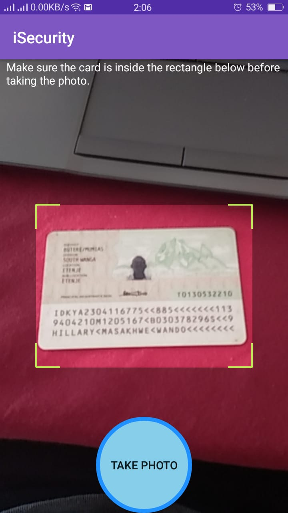

# iSecurity - Android App

iSecurity is a self-hosted security app meant to be used by security guards to better do their job and maintain securit in business premises.

iSecurity for Android is a product by
[TechCloud Ltd](http://www.techcloud.co.ke/). Please contact the company to make inquires about live demos and other use-case of this app.

iSecurity is currently not available on the Google Play Store or iOS app store.

## About

iSecurity was made for private security companies in Kenya to enhance their work and make it easier by using android smartphones.You can download iSecurity from [here](http://hillarywando.com/blog/isecurity-app/) and follow the instructions to install it on your own smartphone for testing purposes.

Alternatively, you can directly contact [TechCloud Ltd](http://www.techcloud.co.ke/) for a full live demo with free tech support included.

This android application allows a security guard to scan the national IDs of guests coming to a building/business premise and store the data in an easily accessible database.This application was originally created by Hillary Wando with collaboration from the team at TechCloud Ltd.

## Features

The android app lets you:
- Scan national IDs of guests to a building and capture the details on the document (this has only been tested with Kenyan IDs).
- Store guest details in a database where they are easily retrieved and maintained.
- Sign in and out guests to a building without the fuss of them leaving their IDs at the door.
- Add guards, buildings and companies to the system by use of an admin panel built into the app.

## Screenshots

## Permissions

On Android versions prior to Android 6.0, wallabag requires the following permissions:
- Full Network Access.
- View Network Connections.
- Access geo-location.
- Read and write access to external storage.

The "Access geo-location" permission is only used when a building is being registered into the system so as to capture its latitude and longitude and is not utilised otherwise. The network access permissions are made use of for determining infomation on scanned IDs. The external storage permission is used to cache ID images for scraping information.

## Credits  
Thanks to Daniel Mwangi ([linkedIn](https://www.linkedin.com/in/dan-mwangi-18857a16/)) for the inspiration and idea.

## License

This application is released under GNU GPLv3 (see [LICENSE](LICENSE)).
Some of the used libraries are released under different licenses.